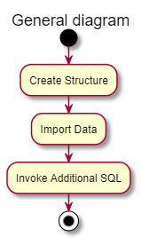
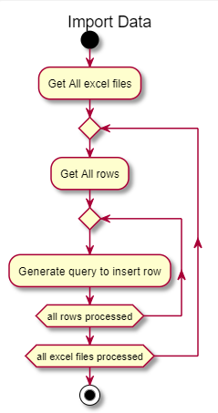

<!--Category:Powershell--> 
 

    
    <a href="http://productivitytools.tech/excel2sql/"><a> 
    

    

# Excel to SQL

Module takes all Excel files from given directory and imports it to SQL Server database.
<!--more-->

<!--og-image-->

## CreateStructure

## ImportData

