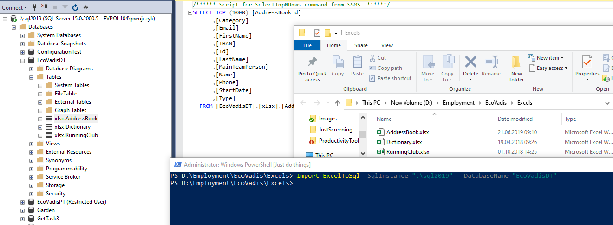

<!--Category:Powershell--> 
 <p align="right">
    <a href="https://www.powershellgallery.com/packages/ProductivityTools.PSImportExcelToSQL/"></a>
    <a href="http://productivitytools.tech/excel2sql/"><a> 
    <a href="https://github.com/pwujczyk/ProductivityTools.PSImportExcelToSQL"></a>
</p>
<p align="center">
    <a href="http://productivitytools.tech/">
        
    </a>
</p>

# Import Excel to SQL

The module takes Excel files from the given directory and imports it to SQL Server database.
<!--more-->

I like to have data in the database. I like to make joins on views on it. For example, I have a table of my team members and different tables which represents their attendance at conferences. On those data, I create views for each year.

Having data in the database is great, but inserting data into it is not so simple task. So I am using excel files for it. I store a bunch of excel files that contain raw data and I am importing them to the database.

This module gets all excel files from the given directory. For each excel it creates table and import data with a similar structure as in excel.

It exposes only one command **Import-ExcelToSql**.

- Directory - Path to directory where excel files are stored, if not provided, the current directory will be used

- SqlInstance - Instance of SQL Server for example \".\\sql2019\"

- DatabaseName  - Name of the database in which tables will be stored

- SchemaName  - Schema in which all excels will be placed, default is **xlsx**

- DropDatabase - If the used database will be drop before the creation

- DatabaseDirectory - If provided mdf and ldf files will be created in this directory

## Examples

```PowerShell
Import-ExcelToSql -SqlInstance ".\sql2019"  -DatabaseName "EcoVadisDT"
Import-ExcelToSql -SqlInstance ".\sql2019"  -DatabaseName "EcoVadisDT" -SchemaName "work" -DropDatabase -Verbose
```

<!--og-image-->


Below you can find a couple of the diagrams which represent steps performed.

## Diagrams 

### General Diagram
The module performs three steps: 
- Creates structure in the database
- Performs data import from excels to SQL Server
- Invokes additional scripts


### CreateStructure

This part creates SQL server schema
- It creates the database, if **Drop database** switch will be used, the database first will be dropped 
- It takes all excels from the given directory
- For each excel it creates the same table as the excel filename
- For each column in excel it creates the column in the table


### ImportData
Imports data opens again those excel files and imports data to SQL data table to previously created schema


### Additional SQL Scripts
Module doesn't recognize all data types, so sometimes after the import, I need to make data operations. For example, I am changing VARCHAR type to decimal for chosen columns

