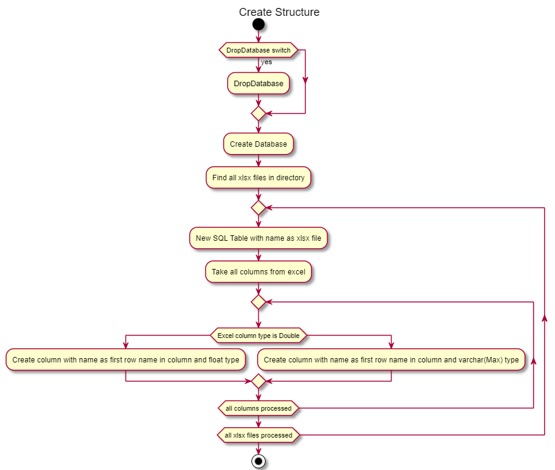

<!--Category:Powershell--> 
 

    
    <a href="http://productivitytools.tech/excel2sql/"><a> 
    

    

# Excel to SQL

Module takes Excel files from given directory and imports it to SQL Server database.
<!--more-->

I like to have data in the database. I like to make joins an views on it. For example I have table of my team members and different different tables which represents their attendance in conferences. On those data I create views for each year.

Having data in database is great, but inserting data to it is not so simple task. So I am using excel files to it. I store bunch of excel files which contains raw data and I am importing them to database.

This module gets all excel files from given directory. For each excel it creates table and import data with the similar structure as in excel.

It exposes only one command **Import-ExcelToSql**.

Below you can find couple of the diagrams which represents steps performed.

<!--og-image-->

## Diagrams 

### Genral Diagram
Module performs tree steps: 
- creates structure in database
- performs data import from excels to SQL Server
- invokes additional scripts

### CreateStructure

This part creates SQL server schema
- it creates database, if **Drop database** switch will be used, database first will be dropped 
- it takes all excels from given directory
- for each excel it creates the same table as excel file name
- for each column in excel it creates the column in table

### ImportData
Imports data opens again those excel files and imports data to SQL Data table

### Additional SQL Scripts
Scripts doesn't recognize all data types, so sometimes after the import I need to make data operations. For example I am changing VARCHAR type to decimal for chosen columns

